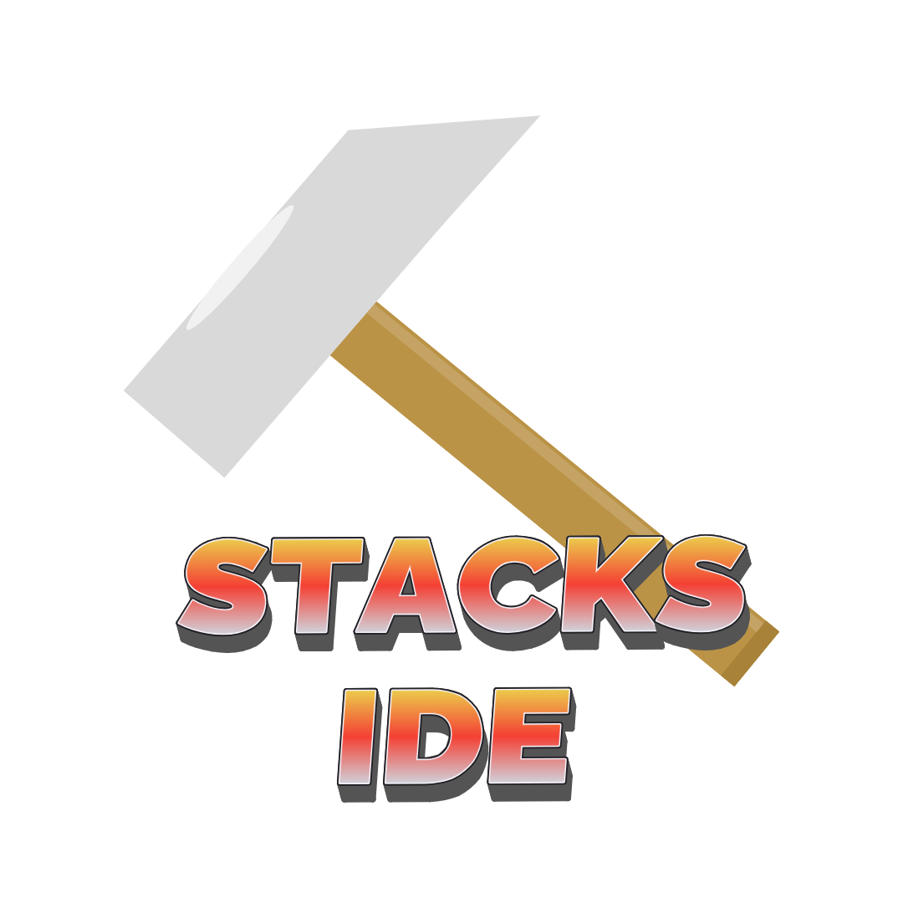

# Stacks-IDE
Simple prototype code editor based on web.

## Project Structure (Beta)

- Front end : Using HTML-CSS-and JavaScript
- Desktop app : Using C++ and Microsoft webview

### Credits

- Powered By [STACKS the NULLS](https://x.com/stacksthenulls)
- Developer : [0xSaad](https://x.com/0xdonzdev)
