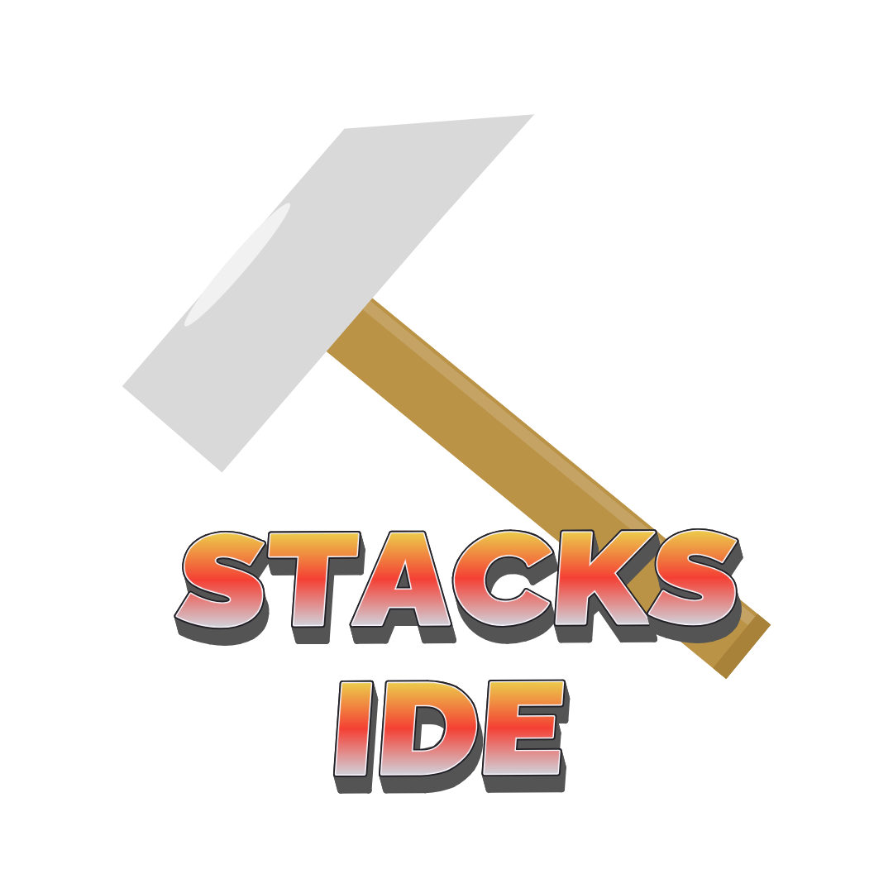

# Stacks IDE

A cross-platform, Fluent-styled code editor and IDE with real language
runtimes. Windows + Linux native shells, a zero-install web UI, and a
lightweight C++ daemon that drives compilation and interactive shells.



> Powered by [STACKS the NULLS](https://x.com/stacksthenulls) · Developer [0xSaad](https://x.com/0xdonzdev)

---

## What's new in 0.2

Stacks IDE graduated from prototype to a real IDE:

- **Fluent 2020s UI** — acrylic / Mica surfaces, activity bar, command
  palette, quick-open, breadcrumbs, integrated terminal, status bar,
  dark + light themes.
- **Real editor** — Monaco with bracket colorization, minimap, indentation
  guides, smooth cursor, word wrap, proper tab management, dirty indicators.
- **File system** — real tree with folders, rename, delete, drag-drop,
  context menus; persistent via IndexedDB offline and the daemon online.
- **Native backend (`core/`)** — a small C++ daemon that exposes:
  - file system read/write/list
  - toolchain detection (Python, Node, C/C++, Java, Shell, Rust, Go)
  - process execution with live streamed stdout/stderr
  - an interactive PTY (ConPTY on Windows, `forkpty` on Linux) so the
    integrated terminal is a real shell.
- **Cross-platform desktop shells** — WebView2 (Windows) and WebKitGTK
  (Linux), both spawn the daemon automatically.
- **CI** — GitHub Actions builds the daemon on Windows and Linux.

---

## Architecture

```
┌─────────────────────────────────────────────┐
│  Desktop shell (WebView2 / WebKitGTK)       │
│  ┌───────────────────────────────────────┐  │
│  │  web/index.html                       │  │
│  │    Monaco + xterm.js + Fluent UI      │  │
│  └──────────┬────────────────────────────┘  │
│             │   HTTP + WebSocket            │
│             ▼                               │
│  ┌───────────────────────────────────────┐  │
│  │  core/stacksd   (C++17)               │  │
│  │    /api/fs  /api/toolchains           │  │
│  │    /ws/run  /ws/pty                   │  │
│  │    ConPTY / forkpty                   │  │
│  └──────────┬────────────────────────────┘  │
│             │                               │
│             ▼                               │
│    g++ · gcc · python3 · node · java · sh   │
└─────────────────────────────────────────────┘
```

All traffic is **loopback-only** and gated by a per-user token written to
`%APPDATA%/StacksIDE/token` or `~/.config/stacks-ide/token`.

---

## Build

### Daemon (always required)

```bash
cmake -S core -B core/build -DCMAKE_BUILD_TYPE=Release
cmake --build core/build -j
# ./core/build/stacksd   (Linux)
# .\core\build\Release\stacksd.exe   (Windows)
```

### Linux desktop shell

```bash
sudo apt install libgtk-4-dev libwebkitgtk-6.0-dev cmake g++
cmake -S linux -B linux/build
cmake --build linux/build -j
./linux/build/stacks-ide
```

### Windows desktop shell

1. Install Visual Studio 2022 with the "Desktop development with C++" workload.
2. Download the [WebView2 SDK NuGet](https://www.nuget.org/packages/Microsoft.Web.WebView2)
   and extract it somewhere.
3. Point `WEBVIEW2_SDK` at the extracted folder and build:

```powershell
$env:WEBVIEW2_SDK = "C:\path\to\Microsoft.Web.WebView2"
cmake -S windows -B windows\build -A x64
cmake --build windows\build --config Release
.\windows\build\Release\stacks-ide.exe
```

### Web UI only (no daemon — browser-only run for JS/HTML)

```bash
cd web
python3 -m http.server 8000
# open http://localhost:8000
```

### One-shot dev loop

```bash
./scripts/dev.sh       # Linux / macOS
.\scripts\dev.ps1       # Windows
```

---

## Keyboard shortcuts

| Shortcut            | Action                         |
| ------------------- | ------------------------------ |
| `Ctrl+P`            | Quick open files               |
| `Ctrl+Shift+P`      | Command palette                |
| `Ctrl+S`            | Save current file              |
| `Ctrl+N`            | New file                       |
| `F5`                | Run active file                |
| `` Ctrl+` ``        | Toggle bottom panel            |

---

## Supported languages (auto-run)

Python · JavaScript / Node · TypeScript · C · C++ · Java · Shell (bash /
PowerShell) · Rust · Go · HTML preview.

New languages are a one-line addition in
[`core/src/runner.cpp`](core/src/runner.cpp#L70).

---

## Project layout

```
Stacks-IDE/
├─ web/              # Front-end (HTML/CSS/JS, Monaco, xterm.js)
│  ├─ index.html
│  ├─ style.css      # Fluent 2020s design tokens + components
│  ├─ app.js         # IDE shell logic
│  └─ assets/        # vfs.js, backend.js, templates.js
├─ core/             # C++ backend daemon (stacksd)
│  ├─ include/stacks/
│  └─ src/
├─ windows/          # WebView2 desktop shell (Windows 11 Mica)
├─ linux/            # WebKitGTK desktop shell
├─ scripts/          # dev.sh / dev.ps1
├─ .github/workflows # CI
└─ CMakeLists.txt
```

---

## Roadmap

- LSP bridge (pyright, clangd, typescript-language-server)
- Source control view (git) with diff gutter
- Remote workspace over SSH
- Extension API
- macOS shell (WKWebView)

---

## License

See [LICENSE](LICENSE).
